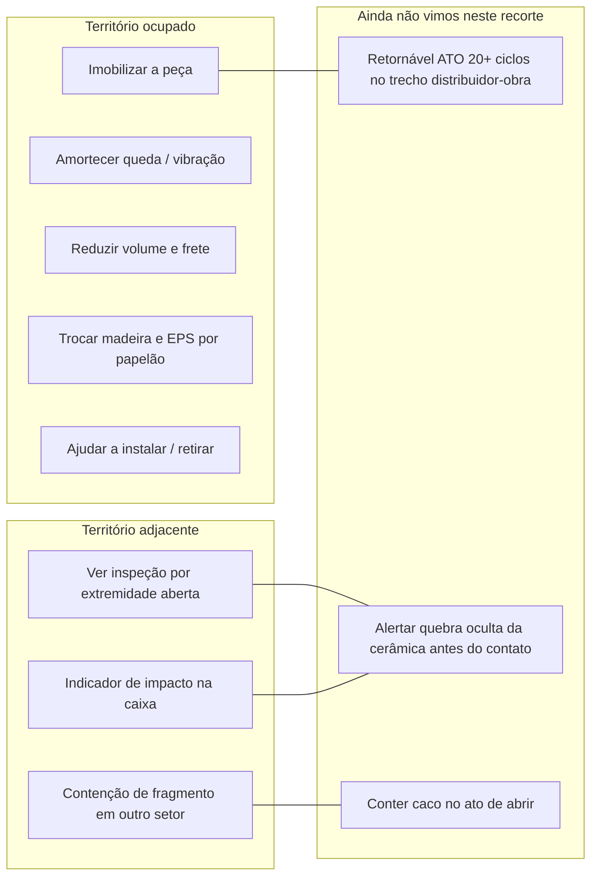
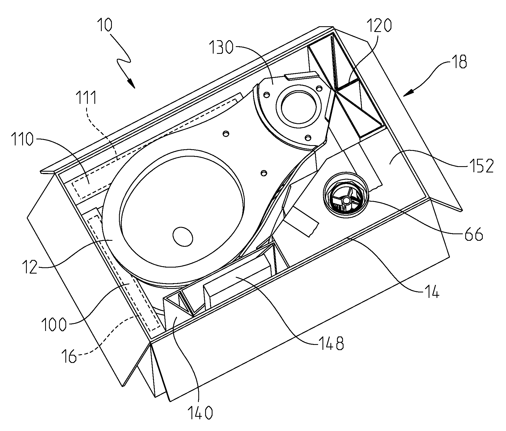
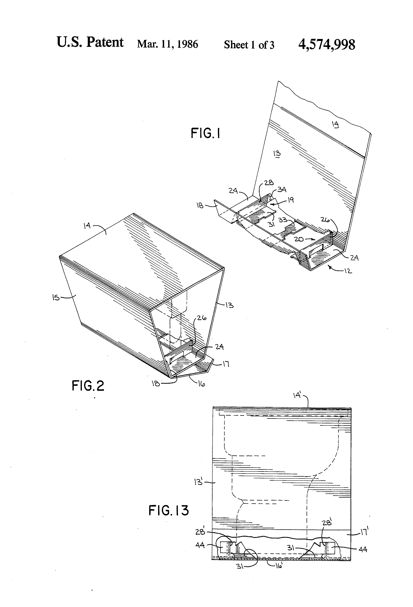
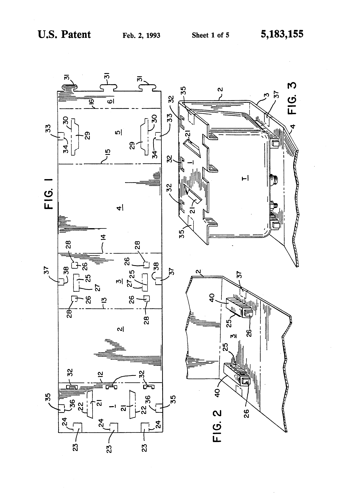
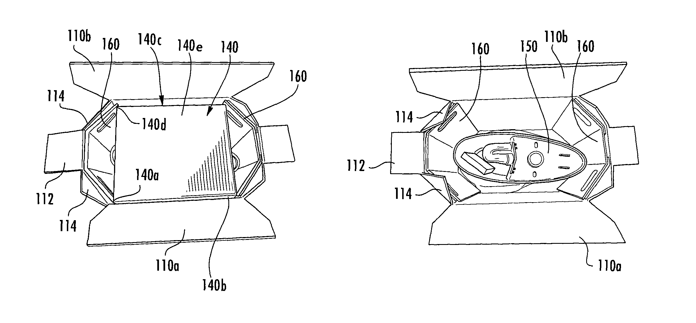
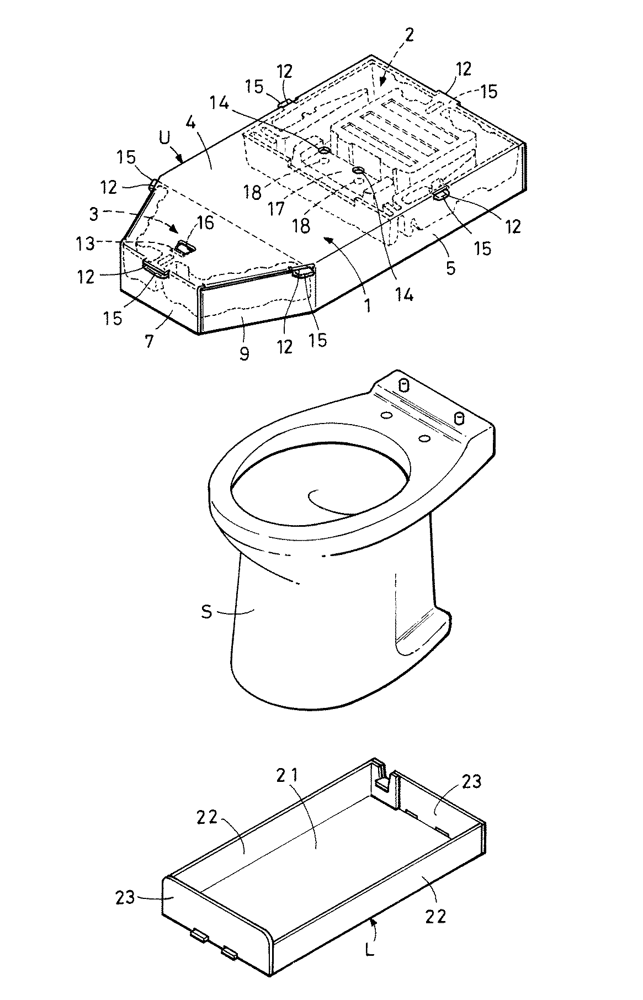
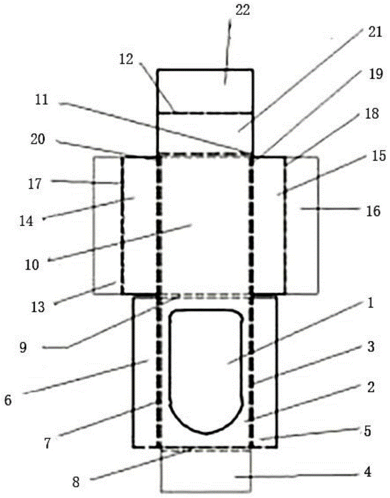
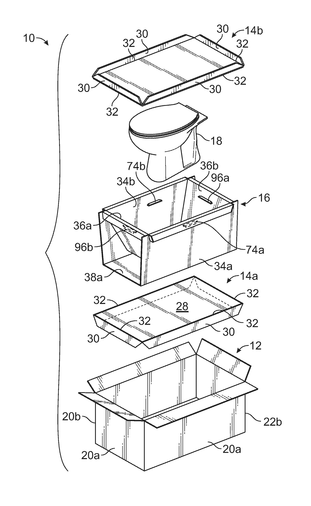
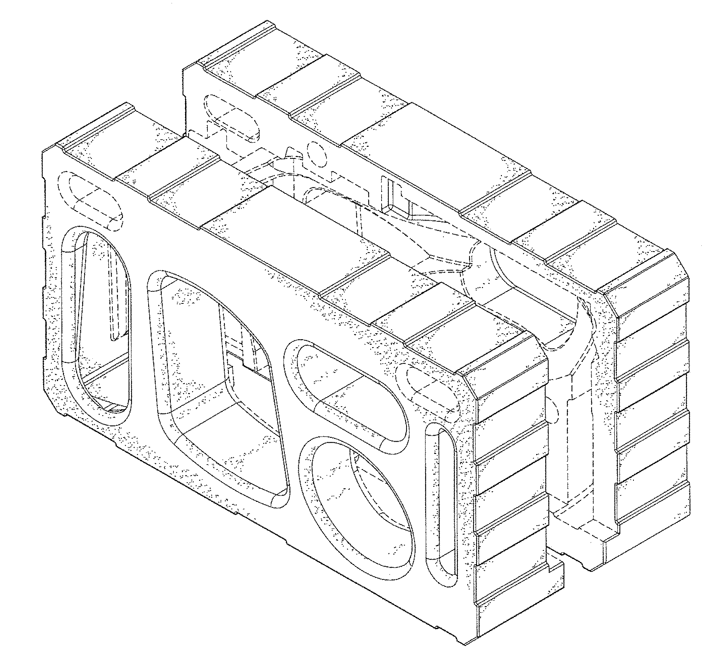
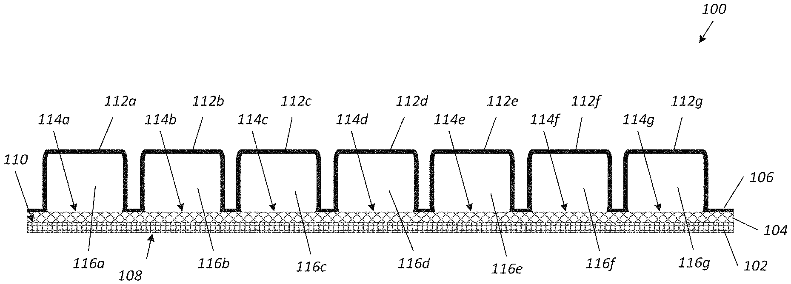

# Anterioridade — patentes e produtos já existentes

**Equipe 2 — Engenharia de Produto / PSP6 · 2026/2**  
**Uso:** dossiê da seção *Soluções existentes / busca de patentes* do pré-desenvolvimento.  
**Conferido em:** 21/09/2026. Cada número, titular, data e frase técnica abaixo foi aberto em fonte pública no mesmo dia.  
**O que isto não é:** parecer de patenteabilidade, análise de liberdade de operação (FTO) nem busca exaustiva no INPI.

---

## Como ler este dossiê

Três camadas, para não misturar o que já existe com o que ainda queremos projetar:

| Camada | O que é | Entra no relatório como |
|---|---|---|
| **A — Patente de louça** | Documento que reivindica embalagem ou calço para vaso, caixa, tampa, cuba ou peça sanitária | Anterioridade direta. Função + limitação + status |
| **B — Tecnologia adjacente** | Indicador de impacto, contenção de fragmento, caixa retornável genérica | Inspiração de função. Não é o mesmo produto |
| **C — Produto comercial** | Embalagem que já circula (TOTO, Deca, ShockWatch, caixa + EPS) | Benchmark de mercado. Sem foto promocional copiada; só o que a página oficial ou o varejo descreve |

Critério de inclusão — o mesmo do dossiê de normas:

> Só entra o que foi **aberto**, com **número, titular, data, o que faz, o que não faz e URL**. Status jurídico é o que o Google Patents / escritório publica, com o aviso deles: *não é conclusão legal*.

Frase que **não** usamos: “não existem patentes” / “o mercado não tem solução”.  
Frase que **usamos**: “nos documentos abertos, a função X está ocupada assim; a função Y não apareceu neste recorte.”

Figuras locais em [`figuras-anterioridade/`](figuras-anterioridade/). São pranchas oficiais baixadas do CDN do Google Patents (`patentimages.storage.googleapis.com`), que reproduz os desenhos publicados pelos escritórios. Uso acadêmico de citação.

---

## 1. O que a disciplina e o recorte pedem

### 1.1 Onde isto entra no relatório

No `.tex` atual a seção ainda é um parágrafo de quatro documentos (`us2015`, `jp2007`, `cn2022`, `us2019`) e marca complementação futura. Este dossiê é o material para essa complementação: reivindicação, família, situação legal e produto comercial.

A Aula 09 da professora trata busca de patentes como ferramenta de **concepção** (funções já cobertas, funções livres, risco de colisão) — não como slide de “inovamos porque ninguém fez”.

### 1.2 Recorte do nosso produto

Fonte: planilha `Planilha_PSP6_Grupo2_Loucas.xlsx` e [VALIDACAO-CADEIA-PROBLEMA-QFD.md](VALIDACAO-CADEIA-PROBLEMA-QFD.md).

- Dispositivo **retornável** (ATO, ≥ 20 ciclos) no fluxo **distribuidor → transporte → descarga → canteiro → retorno**.
- Objeto protegido: louça sanitária cerâmica. Kit bacia + caixa acoplada ≈ **34 kg**.
- Funções de maior peso no Mudge: imobilizar, movimentar, amortecer, conferir sem abrir, pega, retirada segura, veículo, empilhar, estabilidade, custo por ciclo.

A anterioridade que importa é a que toca **essas funções**, não “qualquer caixa de papelão”.

### 1.3 Protocolo da busca (o que foi de fato feito)

| Base | O que foi aberto | O que não foi |
|---|---|---|
| [Google Patents](https://patents.google.com/) | Texto completo, figuras, claims e status das famílias listadas abaixo | Busca de milhares de CN sem leitura |
| Espacenet | Família US9221577 / CA2856292 | Relatório de busca oficial EPO |
| Site do titular / prêmio | TOTO (press + Green Story + Japan Packaging Contest), SpotSee/ShockWatch | Catálogo interno Deca/Dexco |
| Varejo BR | Telhanorte / ficha Dexco: tipo de embalagem e massa | Desenho interno da caixa Deca |
| INPI / Radar Tecnológico B65D | Contexto setorial de embalagens no Brasil | **Não** localizamos família BR *específica* de embalagem de vaso. Confirmar na [Busca INPI](https://busca.inpi.gov.br/) antes de qualquer afirmação de novidade nacional |

**Termos combinados:** `toilet packaging`, `toilet bowl carton`, `sanitary ware packaging`, `closestool transportation`, `frangible porcelain`, `embalagem vaso sanitário`, `louça sanitária papelão`.  
**CIP de partida** (do documento mais próximo, US9221577): **B65D 5/50** (elementos internos de suporte/proteção). Adjacentes úteis: B65D 81/05 (amortecimento), B65D 85/30 (artigos frágeis).

**Como as quatro patentes do `.bib` nasceram:** citação cruzada a partir de US9221577 (Kohler US4574998, Kohler US8763803, Vavra US5183155) e da busca preliminar de agosto/2026 em `03_Projeto/pesquisa/`.

---

## 2. Correção do material-base do grupo

O `referencias.bib` e o parágrafo do pré-desenvolvimento têm três erros factuais. Corrigir **antes** de colar no `.tex`.

| O que está no `.bib` / texto antigo | O que as páginas oficiais mostram | Fonte aberta em 21/09/2026 |
|---|---|---|
| Titular `Mance Corporation of Indiana` | **Masco Corporation of Indiana**, depois cedida à **Delta Faucet Company** (24/02/2015) | [US9221577B2](https://patents.google.com/patent/US9221577B2/en) — Legal events |
| JP e CN: “inventor não identificado” | JP: **Hirokazu Kihata, Hironori Sugita, Tomokazu Minami**, titular **Rengo Co. Ltd.** · CN: **Zang / Zhao / Chen / Du / Dong**, titular **China Packaging Research and Test Center** | [JP2007186235A](https://patents.google.com/patent/JP2007186235A/en), [CN114194553A](https://patents.google.com/patent/CN114194553A/en) |
| Título US2019: “fragile products” | Título oficial: *Shipping container for packaging **frangible** products* | [US10301097B2](https://patents.google.com/patent/US10301097B2/en) |
| JP tratada como solução equivalente às concedidas | Google Patents marca **Pending** (pedido publicado, sem grant listado). Prioridade 13/01/2006 | Mesma página JP |
| “27% menos volume” como fato medido | Número **declarado na especificação** da Masco/Delta (“approximately 27% over conventional arrangements”). Não é ensaio de terceiro | US9221577, parágrafo da Description |

---

## 3. Mapa do território — o que já está ocupado

Leitura honesta do mapa:

- **Ocupado de verdade:** proteger a peça *antes* da quebra, em caixa de ida (quase sempre descartável).
- **Já tentado, com outro recorte:** inspeção visual por caixa aberta nas pontas (Kohler 1986; Vavra 1993) e indicador de *impacto na embalagem* (ShockWatch / NuScale).
- **Não apareceu, nos documentos abertos, um dispositivo retornável de obra** que combine imobilização + conferência sem abrir uma caixa fechada de varejo + contenção de caco.

Isso é sinal de oportunidade para o QFD. Não é prova de novidade.

---

## 4. Cluster A — patentes de embalagem de louça

### 4.1 US9221577B2 / US20150014208A1 — *Packaging system for toilet components*

| Campo | Dado conferido |
|---|---|
| Tipo | Patente de invenção concedida |
| Pedido publicado | US20150014208A1 · 15/01/2015 |
| Concessão | US9221577B2 · 29/12/2015 |
| Prioridade provisória | US61/844,856 · 10/07/2013 |
| Inventores | Paul Curtis; David Ringholz |
| Depositante original | Masco Corporation of Indiana |
| Titular atual (assignment) | **Delta Faucet Company** (19/02/2015, registrado 24/02/2015) |
| Família | Também **CA2856292C** (Canadá, listada Active) |
| Status Google Patents | **Active**. Taxa de 8º ano paga em 20/06/2023. Expiração antecipada listada: **09/07/2034** |
| CIP | B65D 5/50 e correlatas |
| Abrir | [Google Patents — B2](https://patents.google.com/patent/US9221577B2/en) · [A1](https://patents.google.com/patent/US20150014208A1/en) |

**Problema que o documento declara.** Custo de frete e estoque cresce com o volume da caixa; a porcelana exige proteção. A embalagem convencional coloca bacia e caixa **já na posição de uso**.

**Solução reivindicada (claim independente 17, texto lido).** Caixa externa + *location fitment* no fundo com abertura que orienta a base da bacia em **ângulo agudo** em relação ao eixo longitudinal da caixa + membro protetor entre bacia e caixa d’água + pacote da tampa na parede frontal + pacote do assento numa lateral + *fitment* superior sobre a bacia.

**Como monta (Description, Figs. 1–15).** A caixa d’água vai **invertida** (boca larga no fundo da caixa, base estreita para cima), a bacia entra ~**13°** em relação ao eixo da caixa, a tampa fica numa parede de extremidade. Envelope declarado: ≈ **31 × 20 × 18 polegadas**. Alças recortadas nas paredes de extremidade.

**O que a especificação afirma e o que não afirma.** Afirma “approximately 27%” de redução de volume frente a arranjos convencionais. Não publica o ensaio, o lote nem o modelo de comparação. Tratar como **alegação do titular**.

*Fig. 4.1 — US9221577, desenho oficial Fig. 1. Fonte: USPTO via Google Patents.*

**O que cobre dos nossos RCs.** Imobilizar peças entre si; reduzir volume (veículo / empilhar); pega na caixa (handhold 35).  
**O que não cobre.** Retorno da embalagem; conferência sem abrir; alerta de quebra oculta; contenção de caco; ciclo de obra. É embalagem de **ida**, de fabricante a varejo.

**Anterioridade que *ela mesma* cita e que nós abrimos em seguida:** Kohler [US4574998A](https://patents.google.com/patent/US4574998A/en), Kohler [US20130008812A1](https://patents.google.com/patent/US20130008812A1/en) (depois US8763803B2), Vavra [US5183155A](https://patents.google.com/patent/US5183155A/en), almofada inflável [US5348157A](https://patents.google.com/patent/US5348157A/en).

---

### 4.2 US4574998A — *Open-ended carton and carton blank* (Kohler, 1986)

| Campo | Dado conferido |
|---|---|
| Concessão | 11/03/1986 |
| Depósito | 01/08/1984 · US06/636,686 |
| Inventor | Paul P. Vavra |
| Titular | **Kohler Co.** |
| Status | **Expired – Fee Related**. Expiração antecipada listada: 01/08/2004 |
| Abrir | [Google Patents](https://patents.google.com/patent/US4574998A/en) |

**Por que esta patente muda o discurso do grupo.** O texto diz, sem rodeio, que a caixa é “especially suitable for shipping heavy and fragile articles such as toilets” e que os retentores da base **permitem inspeção visual pela extremidade aberta** (“permit visual inspection through a carton open end”).

Ou seja: **conferir sem desmontar a embalagem inteira já foi reivindicado em 1984**, para vaso sanitário, por um fabricante do setor. O gap do projeto **não** pode ser escrito como “ninguém pensou em inspeção”. O gap é outro: inspeção de **quebra oculta dentro de caixa fechada de varejo**, no trecho distribuidor–obra, com dispositivo que volta.

*Fig. 4.2 — US4574998, sheet 1 of 3. Fonte: USPTO via Google Patents.*

**O que não faz.** Não é retornável de obra; não contém fragmentos; não indica impacto. Status expirado: o documento é anterioridade de **estado da técnica**, não trava liberdade de operação por si.

---

### 4.3 US5183155A — *Packaging system for a toilet water tank and cover*

| Campo | Dado conferido |
|---|---|
| Concessão | 02/02/1993 |
| Depósito / prioridade | 20/12/1990 |
| Inventor / titular | Paul P. Vavra (individual) |
| Status | **Expired – Fee Related**. Expiração antecipada listada: 20/12/2010 |
| Abrir | [Google Patents](https://patents.google.com/patent/US5183155A/en) |

**Problema declarado — frase que o nosso campo também ouviu.**

> “because of the nature of the enclosed container, little discouragement is given to careless handlers […] In most cases, **the damage is not apparent until the container is opened**.”

Vavra descreve em 1993 o mesmo fenômeno que as entrevistas do grupo relataram em 2026: a caixa parece intacta; a avaria só aparece na abertura. A resposta dele foi caixa **aberta nas pontas** + calços da tampa e da caixa d’água + risers para o tubo de saída.

*Fig. 4.3 — US5183155, sheet 1 of 5. Fonte: USPTO via Google Patents.*

**Limitação.** Recorte é caixa d’água + tampa, não o kit bacia+caixa do nosso QFD. Não é ATO. Expirada.

---

### 4.4 US8763803B2 / US20130008812A1 — *Packaging for plumbing fixtures* (Kohler)

| Campo | Dado conferido |
|---|---|
| Pedido | US20130008812A1 · 10/01/2013 |
| Concessão | US8763803B2 · 01/07/2014 |
| Continuação | US9233774B2 (prioridade 17/06/2014) |
| Inventores | Peter W. Swart; Michael J. Pagel; Lawrence Duwell; Chad Jorgensen |
| Titular | **Kohler Co.** |
| Status | **Active**. Expiração ajustada listada: **24/08/2032** |
| Abrir | [A1](https://patents.google.com/patent/US20130008812A1/en) · [B2](https://patents.google.com/patent/US8763803B2/en) |

**Problema.** A caixa retangular clássica (Figs. 1A–1C do próprio documento) deixa **canto vazio 22**, gasta volume e ainda assim usa os cantos para resistência à compressão. Reforço interno encarece.

**Solução.** Caixa de planta **não retangular**: a soma dos ângulos entre um lado e os dois adjacentes é **> 180°** (formato que “abraça” a bacia). Insertos planos nas paredes. A caixa dobra plana para estoque (Fig. 9). A Fig. 8 do documento mostra um modo de **levantar** a embalagem.

*Fig. 4.4 — US8763803, desenho de abertura. Fonte: USPTO via Google Patents.*

**O que cobre.** Volume, empilhamento, imobilização, pega.  
**O que não cobre.** Retorno; conferência sem abrir (a inspeção da figura é com tampa aberta); contenção de caco.

---

### 4.5 JP2007186235A — *Packaging material for toilet bowl* (Rengo)

| Campo | Dado conferido |
|---|---|
| Publicação | 26/07/2007 |
| Depósito / prioridade | 13/01/2006 · JP2006006014A |
| Inventores | Hirokazu Kihata; Hironori Sugita; Tomokazu Minami |
| Titular | **Rengo Co. Ltd.** (fabricante japonês de papelão) |
| Status Google Patents | **Pending** — pedido publicado; grant não listado nesta página |
| Abrir | [Google Patents](https://patents.google.com/patent/JP2007186235A/en) |

**Campo de uso declarado no primeiro parágrafo.** “梱包材 […] 便器を建設現場等へ運搬する際” — material de embalagem usado ao **transportar o vaso até o canteiro**. É o único documento do cluster A que nomeia explicitamente o trecho fábrica/obra.

**Solução.** Caixa de papelão **U** que cobre a parte de cima da bacia + amortecedores **moldados** 2 e 3 que se encaixam em furos da caixa (peças 15 → furos 12; orelhas 13 → furos 16) + bandeja de papelão **L** embaixo + **cintas**. O amortecedor 2 tem rebaixo 17 para acessórios e **furos de conferência 14 e 18** para ver o *compartimento de acessórios* — não a trinca da cerâmica.

Cita como estado da técnica a [JPH08119254A](https://patents.google.com/patent/JPH08119254A/en) (*Packing material*, 1996): armação de papelão em **井桁** (grade tipo poço) no lugar de blocos de EPS, porque o isopor já era problema de descarte no Japão dos anos 1990.

*Fig. 4.5 — JP2007186235, Fig. 1. Fonte: JPO via Google Patents.*

**O que cobre.** Amortecer; montar rápido; transporte a obra; ver acessório sem abrir tudo.  
**O que não cobre.** Retornabilidade quantificada; alerta de quebra da peça; contenção de caco. Status *Pending*: não tratar como patente vigente.

---

### 4.6 JPH08119254A — *Packing material* (antecessora da Rengo)

| Campo | Dado conferido |
|---|---|
| Publicação | 14/05/1996 (Heisei 8-119254) |
| Título | Packing material |
| Abrir | [Google Patents](https://patents.google.com/patent/JPH08119254A/en) |
| Titular na página EN | **não veio no cabeçalho** da conversão — não inventamos |

**O que o texto traduzido diz e nós lemos.** Embalagem de papelão que cobre o vaso; por dentro, quadros de reforço em grade que encostam na louça. Motivo declarado: os blocos colados da arte anterior saíam do lugar e o EPS já não podia ser usado por descarte. A Fig. 6 do documento mostra capô superior + bandeja inferior — a mesma arquitetura que a Rengo 2007 aperfeiçoa com moldado.

**Uso para nós.** Prova que a troca EPS → papelão em vaso japonês tem **trinta anos**. Sustentabilidade de calço não é território vazio.

---

### 4.7 CN114194553A / CN114194553B — *Packaging structure for toilet transportation*

| Campo | Dado conferido |
|---|---|
| Pedido | CN202111611085.3 · 27/12/2021 |
| Publicação A | 18/03/2022 |
| Concessão B | **28/01/2025** · CN114194553B |
| Inventores | 臧文清, 赵煜, 陈志强, 杜雨芳, 董婧 |
| Titular | **China Packaging Research and Test Center** (centro chinês de pesquisa e ensaio de embalagem) |
| Status | **Active**. Expiração antecipada listada: **27/12/2041** |
| Abrir | [A](https://patents.google.com/patent/CN114194553A/en) · [B](https://patents.google.com/patent/CN114194553B/en) |

**Problema declarado.** Vaso cerâmico, “generally weighs about 50 kg”; “the rate of damage during transport is relatively high” — **sem percentual**. A forma atual que eles descrevem: **caixa + armação de madeira + EPS**. Custo alto, montagem difícil, volume/peso sobem o frete, “não protege o ambiente”.

**Solução.** Um único blank de forro interno, cortado e vinco, dobrado em fundo / costas / teto / laterais, com **furo de posicionamento do vaso (1)** no fundo e chanfros em arco nas dobras (anti-risco no manuseio). Método em quatro passos: corte → vinco → dobra → pronto. Objetivo: **substituir madeira e EPS**.

A especificação afirma proteção contra **pressão, vibração e queda**. Não descreve ensaio ISTA/ASTM no texto que lemos.

*Fig. 4.7 — CN114194553, Fig. 1 (desenvolvido). Fonte: CNIPA via Google Patents.*

**O que cobre.** Amortecer / imobilizar com papelão; sustentabilidade; custo de montagem.  
**O que não cobre.** Retorno; inspeção; caco. Os 50 kg são a massa do vaso chinês de referência — **não** copiar como massa do nosso kit (a planilha usa ≈ 34 kg).

---

### 4.8 US10301097B2 — *Shipping container for packaging frangible products*

| Campo | Dado conferido |
|---|---|
| Pedido publicado | US20170362010A1 · 21/12/2017 |
| Concessão | 28/05/2019 |
| Prioridade | 26/02/2016 |
| Inventores | Trevor James Groff; Waylande Juan Sanchez |
| Titular | **International Paper Company** |
| Status | **Active, expires 16/03/2037** (adjusted) |
| Abrir | [B2](https://patents.google.com/patent/US10301097B2/en) |

**Problema.** Vasos, cubas e banheiras de porcelana iam em **caixote de madeira** com insertos de madeira/metal: pesado, caro, difícil de montar.

**Solução.** Caixa RSC de papelão + três blanks: inserto de fundo 14a, **célula de ar cônica** 16 (dois U que se travam por fendas inclinadas) e inserto de tampa 14b. A parte estreita da célula segura o pé da bacia; a parte larga sobe com o bojo; células extras no topo. O texto diz que o conjunto protege “no matter what face, edge or corner it is dropped on”.

*Fig. 4.8 — US10301097, Fig. 1. Fonte: USPTO via Google Patents.*

**O que cobre.** Imobilizar; amortecer queda em qualquer face; substituir madeira; transporte por transportadora comum.  
**O que não cobre.** Retorno; conferência; indicador; caco. É a família mais próxima de “estrutura sacrificial de papelão ao redor da louça”.

---

### 4.9 USD795704S1 — *Packaging for sanitary ware* (design)

| Campo | Dado conferido |
|---|---|
| Tipo | **Patente de desenho** (1 claim ornamental) |
| Concessão | 29/08/2017 |
| Depósito / prioridade | 20/05/2016 · US29/565,503 |
| Inventores | Abraham Tanus; Sarah Tanus; Jose Daniel Alanis Garza; John Clayton Evans; Edgar David Arellano-Robles; Jorge Alberto Algraves-Yarza |
| Titular | **Mountainside Investment Group, LLC** |
| Família | Também **CA171646S** (Canadá, Active) |
| Status | **Active**. Expiração antecipada listada: **29/08/2032** |
| Abrir | [Google Patents](https://patents.google.com/patent/USD795704S1/en) |

Única reivindicação: “the ornamental design for packaging for sanitary ware, as shown and described.” A Fig. 8 (não reproduzida aqui) mostra um vaso **não reivindicado** recebido numa metade da embalagem. Linhas tracejadas = não fazem parte do design.

*Fig. 4.9 — USD795704, Fig. 1. Fonte: USPTO via Google Patents.*

**Uso para nós.** Confirma que o *look* da embalagem de louça também é território de PI. **Não** gera função de segurança. Não copiar a silhueta se um dia formos a registro de desenho industrial no INPI.

---

## 5. Cluster B — tecnologias adjacentes (função, não louça)

### 5.1 Indicador de impacto comercial — ShockWatch 2 (SpotSee)

Produto **à venda**, não só patente. Aberto em:

- Loja: [shop.spotsee.io — ShockWatch 2](https://shop.spotsee.io/impact_indicators/logistics_indicators/shockwatch_shockwatch)
- Folha técnica: [ShockWatch 2 Overview (PDF)](https://2072862.fs1.hubspotusercontent-na1.net/hubfs/2072862/Product%20Files/ShockWatch%202/ShockWatch%202_Overview.pdf)
- Família de indicadores: [Impact Indicators for Packaging (PDF)](https://spotsee.io/wp-content/uploads/2019/07/Impact-Indicators-for-Packaging_English-01-19-2022-1.pdf)

**O que o fabricante afirma e nós copiamos só o que está no datasheet.**

| Spec | Valor no PDF SpotSee |
|---|---|
| Função | Indicador de uso único, *tamperproof*, arma no campo; fica **vermelho** acima do limiar |
| Sensibilidades | 5G, 10G, 15G, 25G, 37G, 50G, 75G (P/N 45000K–51000K) |
| Duração do impacto | 0,5–50 ms |
| Tolerância | ±15% a 20 °C / 1 ATM |
| Temperatura | −25 °C a 80 °C |
| Dimensão | 42,93 × 42,93 × 6,35 mm |
| Vida de prateleira | 2 anos a 20 °C / 1 ATM |
| Adesivo | Acrílico |

O PDF de overview diz: se o indicador está vermelho, **não recusar a carga**; anotar, manter a embalagem original e pedir inspeção da transportadora. Ou seja: o produto detecta **mau manuseio da caixa**, não a trinca da cerâmica.

A loja declara proteção por patentes US. Abrimos [US8234994B1](https://patents.google.com/patent/US8234994/en) — *Impact indicator*, inventor Clinton A. Branch, titular **ShockWatch, Inc.**, concessão 07/08/2012, status **Active**, expiração antecipada listada 09/03/2032. O número 8,234,994 bate. O segundo número da loja (9,423,312) **não foi aberto nesta passagem** — não citar até conferir.

O material de marketing da SpotSee fala em redução de 40–60% de avaria. Isso é **alegação comercial**, sem denominador público para louça. Não usar no relatório como taxa do nosso problema.

**Relação com o QFD.** Inspira “conferir / alertar”. Não substitui o dispositivo: cola na caixa de ida, é descartável, não imobiliza 34 kg e não contém caco.

---

### 5.2 US10597214B2 — *Combined shipping protection and impingement detection wrap*

| Campo | Dado conferido |
|---|---|
| Concessão | 24/03/2020 |
| Prioridade | 30/12/2016 |
| Inventor | Marc Alan Zocher |
| Titular | **NuScale Power, LLC** (licença confirmatória ao U.S. Department of Energy, 10/04/2018) |
| Status | **Active, expires 08/05/2038** |
| Abrir | [Google Patents](https://patents.google.com/patent/US10597214B2/en) |

**Mecanismo (claims / examples lidos).** Três camadas: base impermeável a gás + camada indicadora + topo impermeável em **células**. Cada célula leva gás inerte (ex.: nitrogênio). Se o topo rompe no impacto, o indicador reage com o oxigênio do ar e **muda de cor no ponto**. Proteção e evidência no mesmo wrap.

*Fig. 5.2 — US10597214, Fig. 1. Fonte: USPTO via Google Patents.*

**Limitação para o projeto.** Nasceu no contexto de proteção de componentes (NuScale é empresa de reator modular). Não é calço de vaso. Custo e escala incompatíveis com kit de R$ de construção, até prova em contrário. Serve como **analogia funcional** da combinação proteção + indicação — exatamente o que o briefing de agosto/2026 já apontava.

---

### 5.3 EP2780725A1 / EP2780725B1 — indicador de impacto de uso único

| Campo | Dado conferido |
|---|---|
| Publicação A | 24/09/2014 |
| Concessão B | 07/10/2015 |
| Prioridade | 18/11/2011 |
| Inventor / titular | Ronan Schonberg (individual) |
| Status Google Patents | **Granted** na A; linha de status **Not-in-force** |
| Abrir | [A1](https://patents.google.com/patent/EP2780725A1/en) |

Indicador irreversível que muda de aparência após choque. Confirma a família europeia de “impacto → evidência visual”. **Fora de vigor** na etiqueta do Google Patents: útil como arte, não como direito oponível. Não aprofundamos claims além do cabeçalho — se for para FTO, abrir o B1 no Espacenet.

---

### 5.4 Outras adjacentes do briefing de agosto — o que reabrimos

| Documento | Status da reabertura | Uso |
|---|---|---|
| [US6321911B1](https://patents.google.com/patent/US6321911B1/en) *Fragility package* | Citada no briefing; **não relida por completo nesta passagem** | Inspeção visual sem abrir — analogia de vidro/objeto, não louça |
| [US4506793A](https://patents.google.com/patent/US4506793A/en) *Breakable vial* | Idem | Manga que contém fragmento de ampola. Analogia de **caco**, setor farmácia |
| [US5348157A](https://patents.google.com/patent/US5348157A/en) *Inflatable packaging cushion* | Citada como prior art em US9221577 | Casa com o relato de campo: inflável “funciona, custo inviável” |

Não atribuímos claims a esses três além do que o título/abstract já estabelece no briefing. Se a banca perguntar, abrir a página — o link está testado.

---

## 6. Cluster C — produtos que já circulam

### 6.1 Embalagem convencional brasileira (Deca / varejo)

A professora pediu, em 24/08/2026, para **olhar a embalagem premium Deca no ponto** (`FEEDBACK-PROFESSORA-2026-08-24.md`, 13:26–14:18). Isto **não substitui a visita**. O que dá para afirmar com página aberta:

| SKU | O que a ficha diz | Fonte |
|---|---|---|
| Bacia LK para caixa acoplada, Deca | Embalagem: **papelão / caixa**. Massa listada **37 714 g**. Dimensões 40,5 × 35,7 × 61,9 cm | [Telhanorte](https://www.telhanorte.com.br/bacia-para-caixa-acoplada-link-gelo-deca-1095170/p) |
| Bacia convencional Quadra, Deca | Embalagem: **papelão / caixa**. Massa **23 760 g** | [Telhanorte](https://www.telhanorte.com.br/bacia-convencional-quadrada-gelo-deca-1221086/p) |
| Kit Axis bacia + caixa, Deca | Tipo da embalagem: **caixa de papelão**. Conformidade declarada NBR 16727-1 / 16727-2 | [Ficha EAN 7894202002787](https://encontraproduto.com.br/ean/7894202002787/kit-vaso-sanitario-com-caixa-acoplada-axis-3-6l-branco-deca.htm) |

O que **não** está nessas fichas: gramatura do papelão, se há EPS, se há cinta, se a caixa é parede simples ou dupla, taxa de quebra, se é retornável (é de ida). Não desenhar o interior Deca de memória.

A massa do varejo (24–38 kg só a bacia; kit completo maior) confirma o recorte ergonômico da planilha: a peça **sozinha** já estoura o teto de levantamento. Qualquer dispositivo nosso que some massa compete com o RP2.

---

### 6.2 TOTO — embalagem de papelão como produto industrial premiado

Três fontes oficiais da própria TOTO / Japan Packaging Institute, não de blog:

**a) Green Story — mais de 20 anos só em papelão renovável.**  
[jp.toto.com/greenchallenge/technology/story/13/en](https://jp.toto.com/greenchallenge/technology/story/13/en/)  
Kentaro Kirino (Package & Printing, Washlet). Warmlet: fundo duplo no lugar do calço; montagem de 52 etapas → 20; **21 s/peça**; redução de material **50%**. Washlet com caixa: junta de papel que se solta e a **caixa sobe**, o produto fica no chão — “this joint system package has been patented”. Inspeções não anunciadas de vibração/choque “dozens of times”. Material −48%, massa −≈ 2 kg.

**b) Japan Packaging Contest 2012 — *Eco-friendly package for WASHLET tank*.**  
[jpi.or.jp/saiji/jpc/2012/en003.html](https://www.jpi.or.jp/saiji/jpc/2012/en003.html)  
Bandeja + cobertura de ondulado + juntas moldadas de polpa nos quatro lados; uma ação para soltar. Material −48%, custo de material −40%.

**c) Japan Packaging Contest 2018 — partição “uncrushed” com mola de papelão.**  
[jpi.or.jp/saiji/jpc/2018/en003.html](https://www.jpi.or.jp/saiji/jpc/2018/en003.html)  
WASHLET para exportação: dobra que recupera forma depois do primeiro impacto — o ponto fraco clássico do papelão.

**d) WorldStar 2024 — *Easy installation packaging* (NEOREST WX).**  
Press TOTO, 22/01/2024: [PDF EN](https://www.toto.com/en/press/pdf/worldstar20240122_en.pdf) · [página JP](https://jp.toto.com/company/press/2024_01_22_01/).  
A WPO anunciou 214 vencedores em 09/01/2024 ([worldstar.org/news_detail/20](https://worldstar.org/news_detail/20/)). A ficha individual TOTO no site da WPO **não foi localizada nesta passagem**; o fato do prêmio está na **fonte primária TOTO**.

O que o PDF TOTO descreve, e só isso:

1. Fundo do vaso redondo — não se sustenta; superfície superior inclinada — **não pode receber carga de compressão** na cerâmica.
2. Resposta: mais dobras na frente/trás para a **caixa** absorver empilhamento; apoio oblíquo atrás para espalhar peso; divisórias em cruz no fundo.
3. Lateral lisa — não há pega. A embalagem vira **gabarito de instalação**: desliza até a parede com o vaso ainda no suporte.

Há um segundo WorldStar 2024 TOTO para **bancada de mármore artificial** (Marbright): recorte triangular no encosto do suporte para amortecer o choque entre módulos. Não é vaso; mostra a mesma casa (cerâmica/brittle + papelão estrutural).

**O que a TOTO ocupa que o nosso QFD também pede.** Retirada sem levantar o produto (junta que solta a caixa); pega/instalação; amortecer sem EPS; menos massa de embalagem.  
**O que a TOTO não é.** Não é retornável de distribuidor brasileiro. É embalagem de **ida** de fabricante, para produto de alto valor (NEOREST / WASHLET), com linha própria de ensaio. Não copiar estética; copiar a **função** “a embalagem ajuda a colocar / tirar”.

---

### 6.3 Arquitetura ainda dominante: caixa + madeira/EPS

Não é patente. É o **estado de fato** que a CN114194553 descreve como “present packing form” e que a JPH08119254 já tentava abandonar em 1996. No Brasil, as fichas de varejo só dizem “caixa de papelão”; o interior (EPS, canto, cinta) **só se confirma na visita Deca / no estoque do distribuidor**.

Enquanto essa visita não acontecer, o relatório pode dizer:

> A forma industrial recorrente, documentada em patente chinesa de 2022 e em patente japonesa de 1996, é caixa externa + calço sacrificial (EPS, madeira ou papelão). As fichas brasileiras de Deca confirmam a caixa de papelão e a massa; não confirmam o calço interno.

---

### 6.4 Inflável

- Campo do grupo (`ROTEIRO-BANCA-5MIN.md`): o distribuidor relatou que sistemas infláveis **funcionam** e o **custo inviabiliza** a operação.
- Arte: US5348157A (1994), citada pela Delta/Masco.

Não nomeamos marca (Sealed Air Instapak etc.) sem página de aplicação em louça aberta. O ponto útil para o QFD: amortecer ≠ caber no custo por ciclo.

---

## 7. Matriz função × anterioridade × nossos RCs

Legenda: ● cobre de verdade · ◐ cobre em outro recorte · ○ não cobre nos documentos abertos.

| Função (QFD / Mudge) | Delta US9221577 | Kohler 1986 / 2014 | Rengo JP2007 | CN114194553 | IP US10301097 | TOTO comercial | ShockWatch |
|---|:-:|:-:|:-:|:-:|:-:|:-:|:-:|
| Imobilizar a louça | ● | ● | ● | ● | ● | ● | ○ |
| Amortecer impacto | ◐ | ◐ | ● | ● | ● | ● | ○ |
| Empilhar / compressão na **caixa** | ● | ● | ◐ | ◐ | ● | ● | ○ |
| Reduzir volume / frete | ● | ● | ○ | ● | ◐ | ● | ○ |
| Pega / movimentar | ◐ alça | ● | ○ | ○ | ○ | ● gabarito | ○ |
| Retirada sem esforço excessivo | ○ | ○ | ○ | ○ | ○ | ● junta/deslize | ○ |
| Conferir sem abrir caixa fechada | ○ | ● extremidade aberta | ◐ furo de acessório | ○ | ○ | ○ | ◐ impacto, não trinca |
| Alertar quebra oculta da cerâmica | ○ | ○ | ○ | ○ | ○ | ○ | ○ |
| Conter caco na abertura | ○ | ○ | ○ | ○ | ○ | ○ | ○ |
| Retornável ≥ 20 ciclos, obra BR | ○ | ○ | ○ | ○ | ○ | ○ | ○ |
| Custo por ciclo compatível com kit | ? ida barata | ? | ? | afirma ↓ custo | ? | premium | adesivo barato, outra função |

A última linha de ○○ é o espaço que a planilha já isolou. A linha “conferir” **não é vazia** — Kohler/Vavra e ShockWatch ocupam fatias. O que falta é a fatia **caixa fechada de varejo + cerâmica já quebrada + trabalhador no canteiro**.

---

## 8. O que procuramos e **não** encontramos (com o mesmo rigor)

Afirmações permitidas, todas negativas e delimitadas:

1. **Nenhuma família BR específica de embalagem de vaso** apareceu nas buscas públicas feitas em 21/09/2026. O Radar Tecnológico INPI de embalagens ([PDF 2018](https://www.gov.br/inpi/pt-br/assuntos/informacao/arquivos/n16RadarTecnologico_Embalagem_verso26072018.pdf)) mostra milhares de B65D no Brasil — o setor existe; o recorte “louça sanitária / vaso” não veio no recorte textual. **Próximo passo obrigatório:** busca formal na Busca INPI com B65D 5/50 + “vaso sanitário” / “louça sanitária” / “bacia sanitária”.
2. **Nenhum documento aberto reivindica contenção de fragmentos de louça sanitária** no ato da abertura.
3. **Nenhum documento aberto é um ATO retornável** dimensionado para o trecho distribuidor–obra brasileiro.
4. **Não há taxa oficial brasileira de quebra no transporte de louça.** ANFACER dá escala (22 milhões de peças/ano) — não denominador de avaria. Já estava no levantamento de agosto; permanece.
5. **Não descrevemos o interior da caixa Deca.** A professora pediu visita; a visita não está documentada neste dossiê.

---

## 9. Implicações para a concepção (sem escolher conceito)

1. **Não redesenhar a caixa de ida da fábrica.** Delta, Kohler, International Paper, Rengo, TOTO e o centro chinês já saturaram encaixe, ângulo, célula de ar e troca de EPS. Competir ali é colidir com Active (US9221577 até 2034, US8763803 até 2032, US10301097 até 2037, CN114194553 até 2041).
2. **Roubar funções, não formas.** Da TOTO: retirada sem levantar / gabarito. Da Kohler 1986: inspeção por abertura controlada. Da ShockWatch: evidência irreversível — mas do *evento*, não da trinca. Da Rengo: o recorte “até o canteiro” já foi dito em 2006.
3. **O 27% da Delta não vira meta nossa.** É alegação de titular sobre caixa de ida. Nossa meta de volume/massa sai do Mudge e da ergonomia (kit ≈ 34 kg + massa do dispositivo).
4. **Indicador de impacto sozinho não fecha o QFD.** Detecta queda da caixa; uma trinca de queima ou de descarga interna passa batido. Se usarmos indicador, ele é **complemento**, não o produto.
5. **Design patent USD795704:** se o conceito tiver silhueta de “casulo com janelas ovais”, checar desenho industrial antes de prototipar o visual.
6. **Corrigir o `.bib` nesta semana** — a banca abre o Google Patents.

---

## 10. Tabela-mestra de verificação de fontes

Tudo abaixo foi HTTP 200 / conteúdo lido em **21/09/2026**. Status = etiqueta do Google Patents, com o disclaimer deles.

| # | Documento / produto | URL aberta | Status / dado crítico verificado |
|---|---|---|---|
| 1 | US9221577B2 | https://patents.google.com/patent/US9221577B2/en | Active; Delta Faucet; 27% na spec; 31×20×18 in; ângulo ≈13° |
| 2 | US20150014208A1 | https://patents.google.com/patent/US20150014208A1/en | Mesma família; Masco → Delta |
| 3 | US4574998A | https://patents.google.com/patent/US4574998A/en | Kohler; Expired; inspeção por ponta aberta |
| 4 | US5183155A | https://patents.google.com/patent/US5183155A/en | Vavra; Expired; “damage not apparent until opened” |
| 5 | US20130008812A1 | https://patents.google.com/patent/US20130008812A1/en | Kohler; Granted → US8763803B2 |
| 6 | US8763803B2 | https://patents.google.com/patent/US8763803B2/en | Active; caixa de planta >180° |
| 7 | JP2007186235A | https://patents.google.com/patent/JP2007186235A/en | Rengo; Pending; canteiro; furos de acessório |
| 8 | JPH08119254A | https://patents.google.com/patent/JPH08119254A/en | Grade de papelão; anti-EPS |
| 9 | CN114194553A | https://patents.google.com/patent/CN114194553A/en | Granted 2025 como B; ~50 kg; substitui madeira/EPS |
| 10 | US10301097B2 | https://patents.google.com/patent/US10301097B2/en | International Paper; Active; célula de ar |
| 11 | USD795704S1 | https://patents.google.com/patent/USD795704S1/en | Design; Active; 1 claim |
| 12 | US10597214B2 | https://patents.google.com/patent/US10597214B2/en | NuScale; células que mudam de cor |
| 13 | EP2780725A1 | https://patents.google.com/patent/EP2780725A1/en | Not-in-force (etiqueta GP) |
| 14 | US8234994B1 | https://patents.google.com/patent/US8234994/en | ShockWatch, Inc.; Active |
| 15 | ShockWatch 2 loja | https://shop.spotsee.io/impact_indicators/logistics_indicators/shockwatch_shockwatch | 5–75 G; uso único |
| 16 | ShockWatch 2 PDF | https://2072862.fs1.hubspotusercontent-na1.net/hubfs/2072862/Product%20Files/ShockWatch%202/ShockWatch%202_Overview.pdf | Specs da tabela 5.1 |
| 17 | TOTO press WorldStar | https://www.toto.com/en/press/pdf/worldstar20240122_en.pdf | NEOREST WX; 22/01/2024 |
| 18 | TOTO Green Story | https://jp.toto.com/greenchallenge/technology/story/13/en/ | Junta patenteada; −48% material |
| 19 | JPI 2012 | https://www.jpi.or.jp/saiji/jpc/2012/en003.html | WASHLET tank; −48% / −40% custo |
| 20 | JPI 2018 | https://www.jpi.or.jp/saiji/jpc/2018/en003.html | Partição “uncrushed” |
| 21 | WPO anúncio 2024 | https://worldstar.org/news_detail/20/ | 214 vencedores; não lista TOTO nesta página |
| 22 | Telhanorte LK | https://www.telhanorte.com.br/bacia-para-caixa-acoplada-link-gelo-deca-1095170/p | Papelão; 37,7 kg |
| 23 | Telhanorte Quadra | https://www.telhanorte.com.br/bacia-convencional-quadrada-gelo-deca-1221086/p | Papelão; 23,8 kg |
| 24 | ANFACER (escala, não quebra) | https://www.anfacer.org.br/sobre/numeros-do-setor | 22 milhões/ano — não é taxa de avaria |
| 25 | INPI Radar B65D | https://www.gov.br/inpi/pt-br/assuntos/informacao/arquivos/n16RadarTecnologico_Embalagem_verso26072018.pdf | Contexto; sem família de vaso |

---

## 11. O que falta para fechar a seção no `.tex`

- [ ] Corrigir `referencias.bib` (Masco/Delta; inventores JP/CN; título *frangible*; status JP Pending).
- [ ] Busca formal INPI (B65D 5/50 + termos em português) e colar o print na pasta `pesquisa/`.
- [ ] Visita Deca / estoque do distribuidor: foto do **interior** da caixa (EPS? cinta? parede?). Sem isso a comparação de custo que a professora pediu fica incompleta.
- [ ] Se o conceito usar indicador: abrir US9,423,312 e o MAG 2000 (reutilizável, >500 lb) só se a massa do volume justificar.
- [ ] Não colar este dossiê inteiro no relatório. Colar: 1 parágrafo de método, a tabela do §7, 4 fichas (Delta, Kohler 1986, Rengo, TOTO) e o disclaimer.

---

**Disclaimer.** Busca preliminar em bases públicas, 21/09/2026. Status jurídicos são os publicados nas páginas abertas e devem ser confirmados nos escritórios (USPTO, JPO, CNIPA, EPO, INPI) antes de qualquer decisão de depósito ou de liberdade de operação. Este documento não é parecer jurídico.
