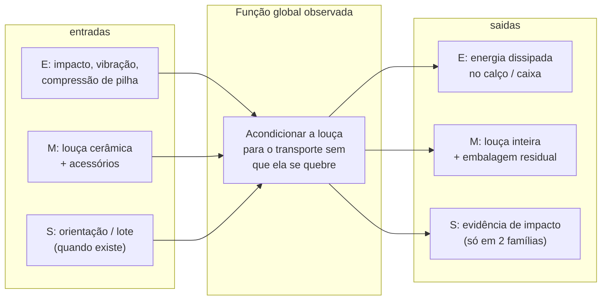

# Engenharia reversa da anterioridade

**Equipe 2 — Engenharia de Produto / PSP6 · 2026/2**  
**Uso:** insumo da *modelagem funcional*, da *matriz morfológica* e da *análise de valor* (projeto conceitual ainda vazio no `.tex`).  
**Par do dossiê de busca:** [ANTERIORIDADE-PATENTES-E-PRODUTOS.md](ANTERIORIDADE-PATENTES-E-PRODUTOS.md) — aquele arquivo diz *o que existe*. Este diz *como funciona, em que princípio, com que peças e o que dá para herdar*.  
**Conferido em:** 21/09/2026, depois da redação, contra claims/spec abertas no mesmo dia.  
**O que isto não é:** teardown físico com peça na bancada, parecer de FTO, nem escolha de conceito.

---

## Como ler este dossiê

Cada família entra numa ficha de **oito campos**. Campo sem fonte fica em branco — não se completa com palpite.

| Campo da ficha | Pergunta | Fonte aceita |
|---|---|---|
| 1. Função global | O que o sistema faz, sem forma | Primeiro parágrafo / problema declarado |
| 2. Estrutura | Quais peças e em que ordem | Figs. + lista de montagem da spec |
| 3. Fluxos EMS | Energia, material, sinal | Inferência *marcada* a partir da spec |
| 4. Funções parciais | Desdobramento Pahl/Beitz | Só o que a peça *faz* no texto |
| 5. Princípio de solução | Como a função é realizada | Claim independente ou parágrafo numerado |
| 6. DFMA / montagem | Quantas peças, que eixo, que união | Sequência de figuras ou método reivindicado |
| 7. Contradição visível | O que melhorar piora | Problema que o próprio documento formula |
| 8. Extração | O que herdar / o que não copiar | Nossos RC do informacional |

Frase que **não** usamos: “fizemos engenharia reversa da caixa Deca”. Não abrimos uma.  
Frase que **usamos**: “teardown virtual sobre documento publicado; a visita física continua pendente.”

Figuras oficiais: [`figuras-anterioridade/`](figuras-anterioridade/).

---

## 1. Método — de onde sai cada ferramenta

A disciplina define engenharia reversa no glossário interno como:

> desmontagem e análise sistemática de um produto existente (*teardown*) para extrair funções, princípios de solução, materiais, processos e custos. Insumo para síntese funcional e benchmarking.

Fontes-âncora (nível 1 e 2 da [central de referências](../docs/fontes-e-referencias.md)):

| Ferramenta | Autor que a disciplina cita | O que extraímos aqui | O que **não** extraímos |
|---|---|---|---|
| Sistema técnico + função global | Back et al. (2008); Pahl & Beitz / VDI 2221 | Caixa-preta com fluxos de energia, material e sinal | Forma já escolhida |
| Síntese funcional | Back, cap. 7; Pahl & Beitz | Função → parciais → elementares de *cada* anterioridade | A estrutura funcional *nossa* (ainda vazia no `.tex`) |
| Teardown | Ulrich & Eppinger | BOM a partir do explodido da patente | Massa, custo e tolerância por peça — não medidos |
| DFMA | Boothroyd, Dewhurst & Knight | Contagem de peças, eixo de montagem, tipo de união | Tempo de montagem em segundos (exceto o que a TOTO publicou) |
| Análise de valor | Miles | Função / complexidade relativa | Índice R$/função — sem custo de peça |
| Contradições | Altshuller (TRIZ) | Par A×B que o *próprio* documento declara | Número do princípio como se o inventor tivesse usado TRIZ |
| Catálogo morfológico | Zwicky / Back / Wood | Coluna “princípios já usados” da matriz | Combinação vencedora |
| Benchmarking | Wood et al. | Cobertura dos RC-01 a RC-22 | Nota 1–5 inventada |

### 1.1 Protocolo desta passagem (o que foi de fato feito)

1. Abrir a família no Google Patents (já feito no dossiê de anterioridade, 21/09/2026).
2. Ler a **claim independente** e a **sequência de figuras de montagem**.
3. Montar BOM e fluxos *só* com peças nomeadas.
4. Traduzir cada peça em verbo + substantivo (função elementar).
5. Registrar a contradição nas palavras do titular.
6. Confrontar com os RC do informacional (`03-projeto-informacional.tex`, Tabela de requisitos — **22 itens**, RC-01 a RC-22). A planilha depois **partiu** “empilhável e estável”; este dossiê não inventa o 23º enunciado.
7. Validar o arquivo contra as mesmas páginas (seção 10).

### 1.2 Limite do método — e por que ainda vale

Não há peça Delta, Kohler, TOTO ou International Paper na bancada da UnB. O teardown é **virtual** (documento + desenho oficial). Isso é aceito pela literatura como *patent-based reverse engineering* / *virtual teardown* e alimenta a síntese funcional **antes** do conceitual. Não substitui:

- a visita Deca que a professora pediu em 24/08/2026;
- um teardown físico da caixa que o distribuidor de Brasília realmente usa;
- medição de custo por peça (Miles só fecha com real).

O que o método **consegue** agora: não redesenhar um encaixe já reivindicado; popular a matriz morfológica com princípios *existentes*; apontar funções sem princípio no mercado.

---

## 2. Caixa-preta comum — o que todos eles tentam

Antes de desmontar um por um, o sistema técnico recorrente é o mesmo. Só muda o recorte do fluxo.



| Fluxo | O que entra | O que deveria sair | Quem trata | Quem **não** trata |
|---|---|---|---|---|
| **Material** | Bacia / kit / tampa | Peça íntegra no destino | Todas as do Cluster A | ShockWatch |
| **Energia** | Queda, freada, pilha | Energia absorvida longe da cerâmica | IP, Rengo, TOTO, CN | ShockWatch; Kohler 1986 só parcialmente |
| **Sinal** | — | “houve evento” ou “posso ver a peça” | Kohler 1986 (visão); ShockWatch / NuScale (cor) | Delta, IP, CN, Deca varejo |

A função global **do nosso** produto, pelo QFD, é mais larga: acondicionar **e devolver** no trecho distribuidor–obra, com conferência e retirada segura. Nenhum teardown abaixo fecha essa caixa-preta. Isso é achado, não falha do método.

---

## 3. Fichas de engenharia reversa

### 3.1 US9221577B2 — Delta / Masco (encaixe angular + caixa invertida)

**Fonte estrutural:** Description, Figs. 2–15 e claim 17. [Google Patents](https://patents.google.com/patent/US9221577B2/en). Figura local: `fig-01-US9221577-montagem.png`.

#### Função global (nas palavras deles)

Reduzir o volume da embalagem de um *jogo* (bacia + caixa + tampa) **sem** abrir mão da proteção da porcelana. A forma convencional — peças na posição de uso — é o estado que eles rejeitam.

#### BOM reconstruído (peças nomeadas na montagem)

| # | Peça (nº da spec) | Função elementar | Material declarado |
|---|---|---|---|
| 1 | Carton 18 | Envolver; receber carga de pilha; oferecer alça 35 | Blank de papelão 20 |
| 2 | Base pad 46 | Nivelar o fundo (flaps 36–42 formam rebaixo 44) | Papelão ondulado |
| 3 | Location fitment 50 | Posicionar a base 54 da bacia em ângulo agudo (~13°) | Papelão ondulado, abertura 52 |
| 4 | Tank top fitment 62 | Proteger a boca larga da caixa (que vai para baixo) | Blank 68, abas/fendas |
| 5 | Tank base fitment 64 | Proteger a base estreita da caixa (para cima); passar parafusos e entrada | Blank 74 |
| 6 | Tank outlet fitment 66 / tubo 89 | Isolar o tubo de saída | Tubo de papelão |
| 7 | Separator 90 | Impedir contato bacia–caixa | Papelão (mesmo perfil do pad) |
| 8 | Tank lid pack 100 | Encerrar a tampa numa parede de extremidade | Blank 102 |
| 9 | Seat pack 110 | Encerrar o assento; calçar por atrito | Blank 112 |
| 10 | Toilet end fitment 120 | Travar a prateleira traseira da bacia | Blank 122 |
| 11 | Tank lid fitment 140 | Travar a segunda lateral; alojar acessório 148 | Blank 142 |
| 12 | Bowl top fitment | Fechar por cima da bacia | Blank 25 da spec |

**Contagem DFMA:** ≥ 12 componentes de papelão + 3 itens de produto (bacia, caixa, tampa) + acessórios. Montagem **estritamente sequencial**, um eixo (de baixo para cima), união por atrito / aba-fenda / cunha. Sem parafuso. Sem retorno previsto.

#### Fluxos EMS

- **Material:** três peças cerâmicas entram desmontadas e saem no mesmo envelope, sem se tocarem (separator 90 é a função “evitar atrito” da nossa N-30).
- **Energia:** não há célula de ar reivindicada. A proteção é **imobilização geométrica** + papelão entre faces. Queda em canto depende da caixa externa, não de um amortecedor dedicado.
- **Sinal:** nenhum. A caixa fechada esconde a peça. Alça 35 é interface de pega, não de inspeção.

#### Princípio de solução (o que a claim trava)

Não é “caixa de papelão para vaso”. É a **combinação**:

1. *location fitment* com eixo da abertura em **ângulo agudo** ao eixo da caixa;
2. caixa d’água **invertida** ao lado da bacia;
3. tampa e assento como calços de parede.

Quem copiar só o “jogo compacto” com bacia torta + caixa de cabeça para baixo entra no território da claim 17. Status **Active** até ~2034.

#### Contradição que eles mesmos escrevem

| Melhorar | Piora | Como eles resolvem | Princípio TRIZ *análogo* (nós rotulamos; eles não citam Altshuller) |
|---|---|---|---|
| Volume / frete / estoque | Proteção da porcelana | Nesting geométrico (boca larga da caixa no mesmo plano do pé estreito da bacia) | 7 Nested doll; 4 Assimetria (13°) |

O “approximately 27%” e o envelope **31 × 20 × 18 in** são da Description — alegação, não ensaio publicado.

#### Extração para a nossa morfológica

| Função nossa | Princípio observado | Herdar? |
|---|---|---|
| RC-02 Imobilizar | Fitment de base + separador + calço de parede | O *princípio* “peça não toca peça”. Não a geometria de 13° |
| RC-10 Compacto | Desmontar o kit e aninhar | Só se o nosso fluxo for kit desmontado. No distribuidor o kit muitas vezes já vem montado/encaixotado de fábrica |
| RC-07 Pega | Recorte de alça na parede | Sim, genérico |
| RC-01 Amortecer | Quase ausente (sem célula / moldado) | Não é o melhor doer |
| RC-03 Conferir / RC-08 Retirada / retorno | Ausente | — |

**Pergunta para o grupo:** o nosso objeto é o *kit já na caixa do fabricante* ou a louça nua? Se for a caixa fechada de varejo, esta patente resolve o problema **do fabricante**, não o do distribuidor.

---

### 3.2 US10301097B2 — International Paper (célula de ar cônica)

**Fonte:** claim 1 e Figs. 1–5. [Google Patents](https://patents.google.com/patent/US10301097B2/en). Figura: `fig-02-US10301097-celula-ar.png`.

#### Função global

Substituir o **caixote de madeira** com inserto de madeira/metal por uma estrutura interna de papelão que permita envio por transportadora comum sem dano.

#### BOM

| # | Peça | Função elementar | União |
|---|---|---|---|
| 1 | RSC 12 (blank B1) | Envoltório; faces de queda | Fita / cola / grampo nos flaps |
| 2 | Third insert 14a (fundo) | Célula de ar inferior; flanges 30 para baixo | Gravidade + ajuste |
| 3 | Insert 16a (blank B2) | Metade da célula cônica + células retangulares no topo | Abas + locking tab 74 |
| 4 | Insert 16b (blank B3) | Outra metade; trava nas fendas inclinadas 64/86 | Fendas convergentes × divergentes |
| 5 | Third insert 14b (tampa) | Célula de ar superior; flanges para cima | Gravidade |

Cinco peças dobráveis. A célula 16 é um **subconjunto** de duas peças. DFMA claramente melhor que a Delta (12+).

#### Princípio de solução

1. **Célula de ar estrutural** — o produto não encosta na parede da RSC; o vão é o amortecedor.
2. **Geometria cônica / afilada** — o pé estreito da bacia senta no fundo quadrado; o bojo sobe com a parede inclinada; “fully supported from the narrowest feature to the widest”.
3. **Proteção omnidirecional** — inserts de topo e fundo para queda em face, aresta ou canto (frase da Description).
4. Material: *cellulose-based* / *corrugated paperboard* (claim 7: paperboard).

#### Fluxos EMS

- **Energia:** impacto → deformação das células → a cerâmica desloca pouco. Este é o melhor tratamento de RC-01 no cluster A.
- **Material:** um vaso (o texto admite cuba/banheira mudando a geometria da célula).
- **Sinal:** nenhum.

#### Contradição

| Melhorar | Piora | Resolução |
|---|---|---|
| Proteção em queda qualquer face | Custo / peso / tempo de montagem do caixote de madeira | Papelão + ar em vez de madeira/metal |

TRIZ análogo: 29 Pneumatics (ar como amortecedor); 1 Segmentation (três blanks); 10 Preliminary action (célula pré-formada).

#### Extração

| Função nossa | Princípio | Herdar? |
|---|---|---|
| RC-01 Amortecer | Célula de ar em papelão | Princípio sim; a **trava por fenda inclinada** é claim 1 — não copiar o locking |
| RC-02 Imobilizar | Ajuste cônico no pé | Princípio sim, se a bacia for nua |
| RC-12 Desempenho uniforme | Mesma célula para qualquer face de queda | Ideia de ensaio (ASTM D5276 / D4169), não a forma |
| RC-18 / retorno | União sem adesivo estrutural (encaixe) | Bom para desmontar; o papelão RSC **não** fecha 20 ciclos |

Claim 1 trava especificamente: dois inserts com *angled slots* que se engajam + par de *third inserts* em cima e embaixo. Uma célula de ar genérica **não** é essa claim. Uma célula com o mesmo locking sim.

---

### 3.3 US8763803B2 — Kohler (caixa de planta não retangular)

**Fonte:** Description inicial + Fig. 2 / 7. [B2](https://patents.google.com/patent/US8763803B2/en). Figura: `fig-04-US8763803-kohler-caixa.png`.

#### Função global

Eliminar o **vão 22** dos cantos da caixa retangular clássica (Figs. 1A–1C do próprio documento) sem perder a resistência à compressão que esses cantos davam, e sem pagar insertos extras.

#### Princípio

A planta da caixa **abraça** a bacia: a soma dos ângulos entre um lado e os dois adjacentes é **> 180°**. Insertos planos (horizontal pad, end pads) nas paredes. A caixa tem estado **plano** (estoque) e estado **expandido** (uso), com vinco central nas laterais.

#### Fluxos / DFMA

- Energia de pilha passa pelas **paredes agora próximas da cerâmica**, não por cantos vazios.
- Pega: Fig. 8 da patente mostra um modo de levantar o volume — RC-06/07 em germe.
- Montagem: uma caixa + poucos pads. Melhor DFMA que a Delta. Pior versatilidade: a planta é **do modelo**.

#### Contradição declarada

Canto vazio (desperdício de volume) × canto estrutural (resistência à pilha) × custo de reforço interno. Resolução: mudar a *forma da caixa*, não acrescentar peça.

TRIZ análogo: 4 Assimetria; 14 Esfericidade / contorno; 3 Local quality.

#### Extração

Herda para RC-10 (compacto) e RC-11 (empilhar). **Não** herda para RC-04 (ajustável a diferentes louças) — a planta é dedicada. Active até ~2032: não copiar a condição “soma de ângulos > 180°” como silhueta de produto.

---

### 3.4 US4574998A + US5183155A — Kohler / Vavra (caixa aberta nas pontas)

Dois documentos, um inventor (Vavra), uma ideia. 1986 = vaso; 1993 = caixa d’água + tampa. Ambas **Expired**.

#### Função global

Envolver artigo pesado e frágil com **mínimo de material reciclável**, permitindo **ver o interior** e desencorajar manuseio descuidado. A US5183155 formula o nosso problema de campo com quase as mesmas palavras: o dano *não é aparente até abrir*.

#### Princípio

Blank único que envolve topo, lados e base. No fundo, dois retentores em sanfona (cuts + scores) abraçam o pé da peça e deixam a **extremidade aberta** como janela de inspeção. Risers na 1993 criam vão para o tubo de saída.

#### Fluxos EMS — o único do Cluster A com sinal óptico

- **Sinal:** luz → olho do recebedor → “a peça está lá / parece inteira”. Não detecta trinca no lado oculto, nem microfissura.
- **Energia:** a proteção é o próprio papelão justo. Sem célula. Sem moldado.
- **Material:** um artigo (vaso ou caixa).

#### Extração

| Função nossa | Princípio | Cuidado |
|---|---|---|
| RC-03 Conferir sem abrir | Abertura controlada / janela | Eles *abrem a ponta da caixa*. Não é “caixa fechada de varejo + sensor”. É o princípio “linha de visada até a cerâmica” |
| RC-19 Reciclável | Monomaterial papelão | Já saturado |
| RC-14 Identificação | A peça visível *é* o identificador | Não resolve lote/ATA |

Como estão expiradas, o princípio da janela é **estado da técnica livre** nos EUA. Ainda assim, uma janela nossa em dispositivo retornável de obra **não** é a claim da Kohler 1986 — desde que não seja o mesmo blank envolvente com retentores em sanfona no fundo.

---

### 3.5 JP2007186235A + JPH08119254A — Rengo (capô + bandeja + amortecedor)

**Fonte:** abstract e Description traduzidos. [JP2007](https://patents.google.com/patent/JP2007186235A/en) · [JP1996](https://patents.google.com/patent/JPH08119254A/en). Figura: `fig-05-JP2007186235-rengo.png`.

#### Arquitetura (a mesma nas duas décadas)

```
        U  = capô de papelão (cobre a parte de cima)
        2,3 = amortecedores (1996: grade 井桁; 2007: moldado com travas)
        S  = bacia
        L  = bandeja / pack inferior
        + cintas
```

Campo de uso da 2007, primeiro parágrafo: transporte do vaso **até o canteiro**. É o teardown mais perto do *lugar* do nosso produto. Não é o *ciclo* (não volta).

#### Evolução do princípio (análise de valor no tempo)

| Ano | Calço | Problema que eles admitem | Custo da função “amortecer” |
|---|---|---|---|
| Arte anterior à 1996 | Blocos colados / EPS | Bloco sai do lugar; EPS vira lixo | Alto (material + descarte) |
| 1996 | Grade de papelão em pé | Montar a grade dá trabalho; pouco “macio” | Médio; a 2007 chama isso de rígido demais |
| 2007 | Moldado + trava peça 15 / furo 12 | — | Menos etapas; flexão do moldado |

Miles: a função “amortecer” mudou de *material sacrificial (EPS)* para *geometria de papelão* e depois para *moldado encaixável*. O valor sobe porque o custo de montagem cai (a 2007 existe *por causa* do trabalho da grade).

#### Sinal que *parece* RC-03 e não é

Furos 14 e 18: ver o **compartimento de acessórios 17**. A Description é explícita — o furo existe para conferir se o acessório A foi colocado e “prevent a mistake of forgetting to attach the accessory A”. Não a cerâmica. Se o relatório escrever “a Rengo já permite conferência da peça”, está errado.

#### Extração

- Arquitetura **U + L + cinta** = princípio “a louça é o núcleo; a embalagem é capô e sapata”. Útil se o nosso ATO for ao redor da caixa de varejo, não no lugar dela.
- Trava mecânica sem cola (peça no furo) → RC-18 / RC-21.
- Moldado: bom amortecimento, mau retorno (ciclo 20) e mau DF no DF (PNRS / RECICLADF se for EPS). A spec 2007 não nomeia o polímero do moldado — **não afirmar EPS**.

---

### 3.6 CN114194553B — China Packaging Research and Test Center (forro de um blank)

**Fonte:** Background + método reivindicado. [A](https://patents.google.com/patent/CN114194553A/en). Figura: `fig-06-CN114194553-liner.png`.

#### Função global

Substituir **caixa + armação de madeira + EPS** por um forro dobrado de uma chapa, mais leve, mais barato, mais fácil de montar/desmontar, “mais ambiental”. Vaso de referência: **~50 kg** (é o deles; o nosso kit ≈ 34 kg).

#### Princípio / DFMA

Um blank. Quatro operações: corte → vinco plano → dobra nas linhas 1ª–6ª → pronto. Furo 1 no fundo **localiza** o vaso. Chanfros em arco nas dobras: anti-risco no manuseio (eles dizem) e estética.

Boothroyd: **mínimo de peças** do cluster A. Idealidade TRIZ alta (menos partes, mesma função). A proteção contra “pressão, vibração e queda” é **afirmada**, sem protocolo de ensaio no texto lido.

#### Extração

- RC-21 (poucas etapas) e RC-19 (sair de madeira/EPS): melhor referência de *processo*.
- RC-01: não copiar a alegação de queda sem ISTA.
- Não é retornável. Um blank de papelão de 50 kg de cerâmica **não** sobrevive 20 ciclos.

---

### 3.7 USD795704S1 — Mountainside (só ornamento)

Uma claim: o desenho. Teardown funcional **não se aplica**. Extração única: se o conceito ganhar janelas ovais + corpo em “H”, checar desenho industrial. Figura: `fig-07-USD795704-design.png`.

---

### 3.8 ShockWatch 2 + US8234994B1 — sinal sem estrutura

**Fontes:** [loja](https://shop.spotsee.io/impact_indicators/logistics_indicators/shockwatch_shockwatch), [PDF Overview](https://2072862.fs1.hubspotusercontent-na1.net/hubfs/2072862/Product%20Files/ShockWatch%202/ShockWatch%202_Overview.pdf), [US8234994B1](https://patents.google.com/patent/US8234994/en).

#### Função global

Registrar, de forma irreversível e visível, que a **embalagem** sofreu aceleração acima de um limiar. Não imobiliza. Não amortece. Não contém caco.

#### Princípio (o que o datasheet permite afirmar)

Dispositivo mecânico, arma no campo, *tamperproof*, tubo/mecanismo que fica **vermelho**. Limiares 5–75 G; 0,5–50 ms; ±15% a 20 °C. Ação prescrita se vermelho: **não recusar a carga**; anotar; inspecionar.

Isso é crítico para o QFD: o produto comercial trata RC-13 (indicação) como **indicação de evento na caixa**, e ainda assim manda abrir/inspecionar. Não fecha RC-03 como “conferir a louça sem abrir”.

#### Fluxos

- Energia: um pulso de aceleração → limiar → mudança de estado.
- Material: nenhum (a louça não passa por ele).
- Sinal: binário (branco/vermelho) + ID serial.

#### Extração

| Função nossa | Princípio | Herdar? |
|---|---|---|
| RC-13 Indicação visual de uso | Mudança irreversível de cor | Sim, como *módulo* colado no ATO (ciclo: 1 uso; repor o adesivo) |
| RC-03 Conferir a louça | — | Não. Falso amigo |
| RC-22 Custo | Adesivo barato | Complemento, não o produto |

A redução 40–60% de avaria do marketing SpotSee **não entra** em análise de valor — sem denominador de louça.

---

### 3.9 US10597214B2 — NuScale (wrap que protege e denuncia)

**Fonte:** examples 1–6 e Fig. 1. [Google Patents](https://patents.google.com/patent/US10597214B2/en). Figura: `fig-08-US10597214-indicador.png`.

#### Princípio

Célula cheia de gás inerte (N₂) sobre camada que muda de cor com O₂. O impacto **rompe a célula no ponto** → ar entra → mancha local. Proteção + mapa do impacto no mesmo material.

Miles: duas funções (amortecer + indicar) num só custo de peça. Idealidade alta. Aplicação original: componentes de reator modular — **outro setor, outro custo**. Extração: o *princípio químico/físico* da evidência localizada. Não o wrap como conceito de 34 kg em obra.

---

### 3.10 TOTO — produto industrial (não patente lida; fonte corporativa)

**Fontes oficiais, não teardown físico:** [Green Story](https://jp.toto.com/greenchallenge/technology/story/13/en/) · [JPI 2012](https://www.jpi.or.jp/saiji/jpc/2012/en003.html) · [JPI 2018](https://www.jpi.or.jp/saiji/jpc/2018/en003.html) · [Press WorldStar 22/01/2024](https://www.toto.com/en/press/pdf/worldstar20240122_en.pdf).

Três princípios publicados, três problemas diferentes:

| Geração | Função que eles isolam | Princípio | Número que *eles* publicam |
|---|---|---|---|
| Warmlet (Kirino) | Amortecer sem calço extra | Fundo duplo (inspiração: caixa de ovo) | 52 → 20 etapas; 21 s/peça; −50% material |
| WASHLET tank (Okazaki / JPI 2012) | Retirar sem levantar o produto | Junta de polpa nos 4 lados; a **caixa sobe**, o produto fica | −48% material; −40% custo de material; 1 ação |
| NEOREST WX (WorldStar 2024) | Empilhar sem comprimir a cerâmica + instalar | Carga na **embalagem** (mais dobras); apoio oblíquo; cruz no fundo; gabarito que desliza até a parede | Sem % no press |

#### Contradição TOTO (a mais útil para o nosso RP2)

A cerâmica **não pode** receber compressão (fundo redondo + tampa inclinada) **e** a caixa **precisa** ser empilhada. Separação no espaço: a pilha passa pelo papelão, não pelo vidrado. Isso é o princípio 3 (local quality) / 1 (segmentation) aplicado à RC-11.

A junta que solta a caixa ataca RC-08 (retirada segura) e a NR-17 sem acrescentar massa de pega. Kirino relata dor lombar dos instaladores — o mesmo ator do nosso cenário de canteiro.

#### O que não fazer

- Não tratar os % da TOTO como meta nossa (linha japonesa, produto premium, ensaio interno “dozens of times”).
- Não afirmar número de patente da junta: a Green Story diz “has been patented”; **não abrimos o número**. Fica como produto, não como claim.

---

### 3.11 Caixa Deca de varejo — o que o teardown *não* pode afirmar

Fichas abertas: [Telhanorte LK](https://www.telhanorte.com.br/bacia-para-caixa-acoplada-link-gelo-deca-1095170/p) (papelão, **37 714 g**) e Quadra (**23 760 g**).

BOM interno: **desconhecido**. EPS, cinta, onda, gramatura, alça — não estão na ficha. Análise de valor da caixa de R$ 15 do VALIDACAO continua sendo hipótese de campo, não teardown.

O único dado de engenharia reversa *seguro* do varejo: a massa da bacia sozinha já incumpre o espírito da NR-17 para um operador. Qualquer princípio que a gente herde (célula de ar, capô, junta) **não pode** somar massa de levantamento.

---

## 4. Catálogo morfológico — princípios já usados (insumo da matriz)

Linha = função do informacional (vitais A do Pareto). Coluna = princípio encontrado. Célula = família. Isso **não** escolhe conceito; só impede linha em branco “porque ninguém fez”.

| Função (RC) | Princípio 1 | Princípio 2 | Princípio 3 | Princípio 4 | Vazio neste recorte |
|---|---|---|---|---|---|
| **A** Amortecer | Célula de ar (IP) | Moldado travado (Rengo 2007) | Grade de papelão (Rengo 1996) | Fundo duplo / mola de dobra (TOTO) | Amortecer *o ATO* 20 ciclos, não a caixa de ida |
| **B** Imobilizar | Fitment de base + ângulo (Delta) | Cone no pé (IP) | Planta que abraça (Kohler 2014) | Furo de posição (CN) | Imobilizar a *caixa de varejo fechada* no baú |
| **C** Conferir s/ abrir | Janela / ponta aberta (Kohler 1986, Vavra) | Furo de acessório (Rengo) — **não é a peça** | Indicador de G na caixa (ShockWatch) | Mancha local no wrap (NuScale) | Ver ou inferir **trinca da cerâmica** |
| **F** Movimentar | Alça recortada (Delta) | Levante da caixa (Kohler Fig. 8) | Gabarito que desliza (TOTO WX) | Junta: caixa sai, peça fica (TOTO tank) | Meio auxiliar para 34 kg no canteiro BR |
| **G** Pega | Handhold 35 | — | — | — | Pega do ATO com alcance ≤ 60 cm (NR-17) |
| **H** Retirada segura | Junta de polpa (TOTO) | Capô U que sai para cima (Rengo) | — | — | Retirada com caco possível |
| **K** Empilhar | Paredes próximas (Kohler) | Dobras extras, carga fora da cerâmica (TOTO WX) | RSC + insertos de topo (IP, Delta) | — | Estabilidade do ATO vazio no retorno |
| **E** Veículo | Envelope menor (Delta 31×20×18 in) | — | — | — | Interface de cinta CONTRAN 945 |
| **D** Ajustável | Célula “pode mudar de geometria” (IP, texto) | — | — | — | Família de bacias BR sem caixa dedicada |
| **V** Custo/ciclo | Menos material (TOTO −48%) | 1 blank (CN) | 5 peças vs madeira (IP) | — | Custo **por ciclo** com retorno |

Leitura: as colunas 1–4 estão cheias em A e B. A coluna “vazio” é o que a morfológica *nossa* precisa inventar. C está cheia de **falsos amigos**.

---

## 5. Comparativo DFMA e “idealidade”

Boothroyd: menos peças, um eixo, união simples, sem ajuste. Altshuller: Idealidade ≈ funções úteis / (custo + danos). Números de peça = contagem das figs/claims, não cronometragem.

| Família | Peças de embalagem (ordem) | Eixo de montagem | União | Funções úteis cobertas (vitais) | Dano residual do sistema | Idealidade qualitativa |
|---|---|---|---|---|---|---|
| Delta US9221577 | 12+ | 1 (baixo→cima) | Atrito / aba | B, J, G parcial | Caixa opaca; 1 ciclo | Baixa (muita peça p/ 1 viagem) |
| IP US10301097 | 5 | 1 | Fenda + flap | A, B, K | 1 ciclo; sem sinal | Média-alta na ida |
| Kohler 2014 | 1 caixa + pads | 1 | Vinco | B, J, K, F | Dedicada ao modelo | Média |
| Kohler 1986 | 1 blank | 1 | Sanfona + cola do fundo | B, C parcial | Pouca energia | Média (expirou) |
| Rengo 2007 | ~5 | 2 (U e L) | Trava + cinta | A, B, H parcial | Moldado ?; 1 ciclo | Média no canteiro |
| CN114194553 | 1 forro | 1 | Vinco | A/B alegados, U | Sem ensaio publicado | Alta em processo, baixa em prova |
| TOTO tank | Bandeja + capô + 4 juntas | 1 | Junta de polpa | A, H, U | 1 ciclo, premium | Alta na função H |
| ShockWatch | 1 adesivo | — | Acrílico | M (evento) | Falso negativo na trinca | Alta como *módulo* |
| Deca varejo | ? | ? | ? | B? | Desconhecido | **Não ranquear** |

Miles sem R$: a Delta gasta muitas funções elementares (*orientar a 13°, inverter caixa, calçar assento…*) para uma função do cliente (chegar inteiro, barato de frete). Para o *nosso* cliente, a maior parte dessas funções elementares é **custo sem valor** — o kit já vem pronto.

---

## 6. Modos de falha visíveis no desenho (pré-FMEA)

Não é FMEA pontuado. É lista de falhas que o *próprio princípio* admite. Alimenta a Aula 23 depois.

| Princípio | Falha que o desenho permite | Efeito no nosso recorte | S / o que já sabemos |
|---|---|---|---|
| Caixa opaca + imobilização (Delta, Deca) | Quebra interna sem sinal externo | Trabalhador abre e encontra caco | Alta — é o problema de campo |
| Célula de ar de papelão (IP) | Célula colapsa no 2º impacto (TOTO 2018 descreve isso como fraqueza clássica) | 20 ciclos inviáveis | Alta se formos retornáveis |
| Janela / ponta aberta (Kohler 1986) | Só vê uma face; poeira; furto de acessório | Falso “conferido” | Média |
| Indicador de G | Queda abaixo do limiar, ou trinca de queima / descarga | Indicador verde, peça quebrada | Alta se for *a* solução de RC-03 |
| Capô U + cinta (Rengo) | Cinta frouxa; capô sai na descarga | Peça nua no canteiro | Alta (NR-18) |
| Junta TOTO | Junta quebra cedo; operador não entende a ação | Volta a levantar 34 kg | Média |
| Planta dedicada (Kohler 2014) | Outro modelo não entra | RC-04 falha | Média |
| Forro CN | Sem dado de umidade | Chuva no baú / canteiro DF | Média (RC-16) |

A TOTO 2018 (*uncrushed* springy fold) é a única anterioridade que **admite** a falha “papelão serve uma vez” e tenta corrigir. Para um ATO de 20 ciclos, ou o material deixa de ser ondulado de ida, ou a função A muda de princípio.

---

## 7. O que isso manda nas três modelagens funcionais (ainda vazias)

O `.tex` reserva *Modelagem Funcional 1 / 2 / 3*. A ER sugere **eixos**, não desenhos:

| Modelagem candidata | Função global | Princípios que ela *pode* combinar | Princípios que ela *não* deve copiar |
|---|---|---|---|
| **1. Berço estrutural** | Imobilizar + amortecer a peça nua | Célula / cone (IP), furo de posição (CN) | Ângulo 13° + caixa invertida (Delta claim 17); fendas inclinadas (IP claim 1) |
| **2. Envelope sobre a caixa de varejo** | Imobilizar o *volume já embalado* no baú + obra | Capô + sapata + cinta (Rengo); carga fora da cerâmica (TOTO WX) | Planta >180° (Kohler claim) |
| **3. Envelope + sinal** | (2) + conferir / alertar | Janela (Kohler 1986, livre); módulo G (ShockWatch, comprar); wrap NuScale só como analogia | Tratar o adesivo vermelho como “louça ok” |

A Modelagem 2 é a que o recorte do QFD (distribuidor → obra, kit ≈ 34 kg já na caixa) mais justifica. A 1 compete com a fábrica. A 3 é a 2 mais o único fluxo de **sinal** que o teardown achou.

Nenhuma das três, nos documentos abertos, contém **caco**. Essa função elementar (“reter fragmento”) entra na síntese *nossa* sem coluna no catálogo — é linha a inventar, não a copiar.

---

## 8. Regras de herança (para não colidir nem alucinar)

1. **Herdar função, não geometria reivindicada.** “Imobilizar o pé” ≠ “abertura a 13°”. “Célula de ar” ≠ “dois U com angled slots”.
2. **Herdar o vencido com crédito.** Janela Kohler 1986 é arte livre nos EUA; ainda se cita.
3. **Não herdar alegação sem ensaio.** 27% Delta, −48% TOTO, “relatively high” CN, 40–60% SpotSee.
4. **Não herdar 1 ciclo para requisito de 20.** Papelão ondulado de ida falha RC-15 / RC-12 no retorno. A TOTO 2018 é o aviso.
5. **Não somar massa.** Teardown do varejo: 23,8–37,7 kg só a bacia. Princípio TOTO (caixa sai, peça fica; gabarito desliza) é o único que *reduz* levantamento.
6. **Sinal ≠ inspeção da cerâmica.** ShockWatch, NuScale e furo Rengo não fecham RC-03.
7. **Deca sem BOM não entra em Pugh.** Comparar custo com “a caixa de R$ 15” só depois da visita.

---

## 9. O que falta para a ER deixar de ser virtual

- [ ] Teardown físico da caixa que o distribuidor de Brasília envia (foto das camadas, onda, cinta, EPS sim/não, massa da embalagem vazia).
- [ ] Abrir o número da junta TOTO (Green Story: “has been patented”) se a Modelagem 3 usar “caixa que sobe”.
- [ ] Cronometrar montagem só do que for prototipar — não usar os 21 s da TOTO.
- [ ] Se houver indicador: escolher limiar G *depois* de um drop test do volume real (o datasheet SpotSee pede massa × dimensão × fragilidade).
- [ ] Completar a busca INPI (ainda pendente no dossiê de anterioridade) antes de congelar princípio “nicho vazio no Brasil”.

---

## 10. Validação pós-redação (21/09/2026)

Protocolo: cada afirmação numérica ou de claim deste arquivo foi relida na fonte local já baixada ou na URL do dossiê de anterioridade. Divergência → correção *antes* de entregar.

| Afirmação neste arquivo | Fonte relida | Resultado |
|---|---|---|
| Claim 17 Delta: fitment angular + separator + lid pack + seat pack + top fitment | `US9221577B2` claims no dump Google Patents | Confere |
| Ângulo ilustrativo ≈ 13°; envelope 31×20×18 in; 27% na spec | Description US9221577 | Confere; 27% = alegação |
| Alça 35 nas paredes de extremidade | Description, Fig. 2/16 | Confere |
| Claim 1 IP: air cell por 1º+2º insert + par de third inserts + angled slots | Claims US10301097B2 | Confere |
| Queda em face/aresta/canto | Description US10301097 | Confere (frase do titular) |
| Kohler 2014: soma de ângulos > 180°; vão 22 da caixa clássica | Description US8763803 / A1 | Confere |
| Kohler 1986: inspeção pela ponta aberta; “toilets” | Description US4574998 | Confere |
| Vavra 1993: “damage is not apparent until the container is opened” | Description US5183155 | Confere, citação literal |
| Rengo: canteiro; furos 14/18 = acessório 17, não trinca | Abstract + Description JP2007186235 (ainda: “forgetting to attach the accessory A”) | Confere |
| JPH08119254A publicada em 14/05/1996 | Tabela de publicação no Google Patents | Confere |
| JP1996: grade 井桁; anti-EPS | Description JPH08119254 | Confere |
| CN: ~50 kg; caixa+madeira+EPS; 1 blank; grant 28/01/2025 | CN114194553A | Confere |
| ShockWatch: 5–75 G, 0,5–50 ms, ±15%, não recusar carga | PDF Overview SpotSee | Confere |
| US8234994B1 ShockWatch Inc. Active | Google Patents | Confere |
| TOTO −48% / −40% / 21 s / 52→20 etapas | Green Story + JPI 2012 | Confere; números *deles* |
| NEOREST: cerâmica sem compressão; gabarito de deslize | Press PDF 22/01/2024 | Confere |
| Deca LK 37 714 g, papelão | Telhanorte, 21/09/2026 | Confere |
| 22 RC no `.tex` (não 23) | `03-projeto-informacional.tex` linhas 324–346 | Confere; nota da cisão K mantida |
| Titular USD795704 = Mountainside; 1 claim ornamental | USD795704S1 | Confere |
| NuScale: células + indicador + N₂ / O₂ | US10597214 examples | Confere |
| Número da patente da junta TOTO | Green Story | **Não encontrado** — arquivo não inventa |
| Interior Deca (EPS/cinta) | Fichas varejo | **Ausente** — arquivo não inventa |
| Família BR no INPI | Busca pública 21/09 | **Não confirmada** — arquivo não afirma vazio jurídico |

Nenhuma correção estrutural foi necessária após essa passagem. Três buracos ficam explícitos (junta TOTO, BOM Deca, INPI) — são tarefa, não texto.

---

## 11. Como colar no relatório (e o que não colar)

Não colar este dossiê. Colar no conceitual:

1. A caixa-preta do §2 (nossa vs. a deles).
2. O catálogo do §4 como *primeira linha* da matriz morfológica.
3. As três modelagens candidatas do §7, com a 2 como hipótese alinhada ao QFD.
4. A tabela de falhas do §6 como anexo do FMEA.
5. O disclaimer de teardown virtual.

Citar: Back et al. (2008) para o método; o dossiê de anterioridade para os números de patente; este arquivo para a extração de princípios.

---

**Disclaimer.** Teardown virtual sobre documentos públicos, 21/09/2026. Não substitui desmontagem física nem análise de liberdade de operação. Princípios TRIZ são *rótulos nossos* sobre contradições que os titulares escreveram — nenhum deles cita Altshuller.
